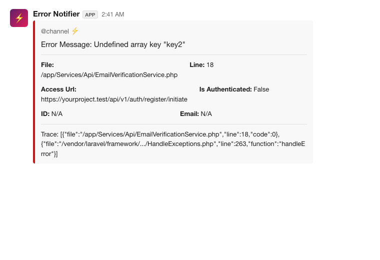
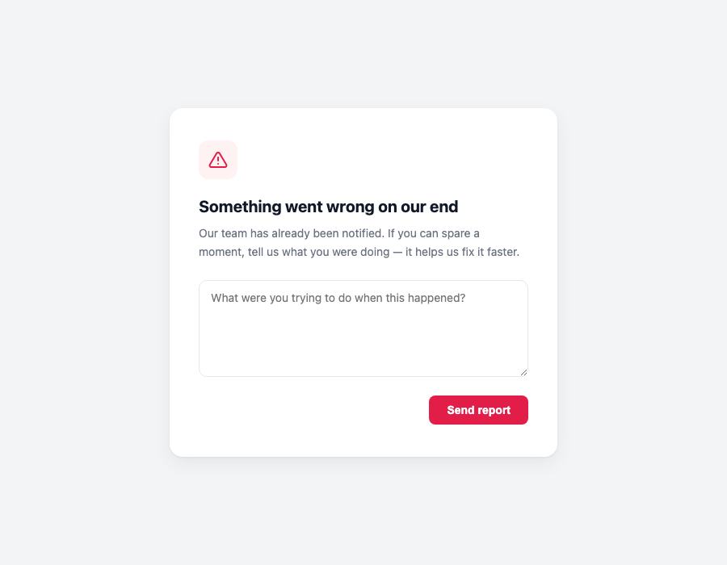

# Error Notification For Laravel

[](https://github.com/jgodstime/laravel-error-notifier/actions/workflows/run-tests.yml)

`jgodstime/laravel-error-notifier` emails and/or Slacks you the moment an uncaught exception happens in your Laravel app — file, line, stack trace, the route it happened on, and who was logged in when it did.

**It works in any Laravel app — API-only, queue workers, console commands, or a full Blade-based site — with zero required setup beyond installing it.** No view, no published files, no wiring into your exception handler needed for the core notification to work.

If your app *does* render Blade views to a browser, there's an optional extra: publish a 500-error feedback page that lets the visitor describe what they were doing when it broke, which gets sent as a follow-up notification alongside the original error. That part is entirely opt-in — skip it for APIs, workers, or anywhere there's no browser to show a page to.

## Compatibility

PHP 8.2+ and Laravel 10, 11, 12, or 13.

> If you're on an older Laravel/PHP version, install the last `1.x` release instead of the latest tag.

## Install

```bash
composer require jgodstime/laravel-error-notifier
```

That's it — no wiring required. The package registers itself on your app's exception handler automatically, so every reportable exception triggers a notification whether or not your app has an `app/Exceptions/Handler.php` file (Laravel 11+ configures exceptions from `bootstrap/app.php` instead, and this works the same either way).

Set at least one of these two in your `.env` and you're done:

```
NOTIFIER_EMAIL="you@example.com"
LOG_SLACK_WEBHOOK_URL="https://hooks.slack.com/services/T...."
```

## What you get

### Email notification

Sent to `NOTIFIER_EMAIL` (or falls back to `MAIL_FROM_ADDRESS`) for every reportable exception:


### Slack notification

Sent to `LOG_SLACK_WEBHOOK_URL` if you've set one — useful alongside email, or on its own:



Both include:

- The error message, file, and line
- A formatted stack trace (see [Change how many stack trace frames are reported](#change-how-many-stack-trace-frames-are-reported))
- The URL the error happened on
- Whether the visitor was authenticated, and their ID/email if so
- The visitor's own description of what happened, *if* your app uses the optional feedback page below and they filled it in

## Optional: feedback page for Blade-based apps

If your app renders views (as opposed to being a pure API), you can let visitors tell you what they were doing when the error happened. Laravel already looks for `resources/views/errors/500.blade.php` to render on any 500 — this package ships one with a short feedback form wired up to it:



Publish it:

```bash
php artisan vendor:publish --provider="ErrorNotifier\Notify\ErrorNotifierServiceProvider"
```

This places `500.blade.php` in `resources/views/errors/`. If you already have one there, move it aside first — publishing won't overwrite an existing file.

When a visitor submits the form, a second notification is sent with their description appended to the original error message. Feel free to restyle the page to match your app — just don't change the **form's `action`** or remove any of the **hidden inputs**, since the notification depends on them.

> Skip this section entirely for API-only apps, queue workers, or anything without a browser in the loop — the email/Slack notification above already works without it.

## Turning off auto-reporting

If you'd rather decide yourself which exceptions get reported (e.g. skip 404s, only report from certain modules), set `NOTIFIER_AUTO_REPORT=false` in your `.env` file and call `Helper::getError()` yourself wherever you want — it's safe to call multiple times on the same exception, it will only ever send once.

```php
// app/Exceptions/Handler.php (Laravel 8-10)
public function register()
{
    $this->reportable(function (Throwable $e) {
        \ErrorNotifier\Notify\Helper::getError($e);
    });
}
```

```php
// bootstrap/app.php (Laravel 11+)
->withExceptions(function (Exceptions $exceptions) {
    $exceptions->reportable(function (Throwable $e) {
        \ErrorNotifier\Notify\Helper::getError($e);
    });
})
```

## Configuration

All of these are read from `.env`; publish the config file with the command above if you'd rather set them in `config/notifier.php` directly.

### Disable instant notification

By default, the package notifies you the moment the error happens, before the visitor has a chance to describe it. Disable that with:

```
NOTIFIER_INSTANT=false
```

### Send email to multiple recipients

```
NOTIFIER_EMAIL="hello1@example.com,hello2@example.com"
```

### Change the redirect page after the feedback form is submitted

Defaults to the home page (`/`).

```
NOTIFIER_REDIRECT_URL='/thank-you'
```

### Change how many stack trace frames are reported

Defaults to 3 frames beyond the exception's own file/line. Set to `0` to report just the exception's own file/line with no additional frames.

```
NOTIFIER_TRACE_LIMIT=5
```

### Queue notifications

Both channels queue by default so a slow mail/Slack request never blocks the one throwing the error — disable it if you'd rather they send inline.

```
NOTIFIER_SHOULD_QUEUE=false
```

## Trying it out

Add a route that throws, then hit it in your browser (with `APP_DEBUG=false` so Laravel's own error page doesn't take over):

```php
Route::get('/test-error', function () {
    $array = ['key1' => 'john'];
    return $array['key2']; // undefined key — triggers the notification
});
```

## Testing

```bash
composer install
composer test
```

## Changelog

Please see [CHANGELOG](CHANGELOG.md) for more information on what has changed recently.

## Contributing

Please see [CONTRIBUTING](CONTRIBUTING.md) for details.

## Security Vulnerabilities

Please review [our security policy](SECURITY.md) on how to report security vulnerabilities.

## Credits

- [Godstime John](https://github.com/jgodstime)
- [All Contributors](../../contributors)

## License

The MIT License (MIT). Please see [License File](LICENSE.md) for more information.
